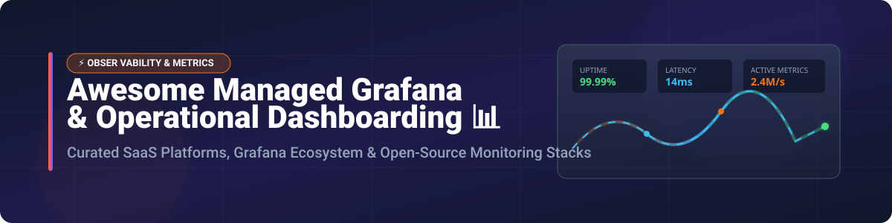

<!-- Header Banner -->

  

# 📊 Awesome Managed Operational Dashboarding (Grafana) Ecosystem 🚀

**A curated list of top managed Grafana services, enterprise SaaS observability platforms, operational dashboarding tools, and open-source metrics/tracing/logging stacks.**

> *Focused on Managed Grafana, Observability Dashboards, Real-Time Operational Monitoring, Prometheus, OpenTelemetry & Self-Hosted Visualization.*

**Last updated: October 2026** 📅

---

## 📑 Table of Contents
- [☁️ SaaS & Hosted Platforms](#️-saas--hosted-platforms)
- [🔓 Open-Source GitHub Projects](#-open-source-github-projects)
  - [🔥 Core Grafana Ecosystem](#-core-grafana-ecosystem)
  - [📈 Metrics & Monitoring Databases](#-metrics--monitoring-databases)
  - [🔍 Integrated Observability Platforms](#-integrated-observability-platforms)
  - [📊 Business Intelligence & Operational Dashboards](#-business-intelligence--operational-dashboards)
  - [⚡ Distributed Tracing & Telemetry Collection](#-distributed-tracing--telemetry-collection)
  - [🛡️ Infrastructure & Network Dashboarding](#️-infrastructure--network-dashboarding)
- [🤝 How to Contribute](#-how-to-contribute)
- [💖 Support & Sponsorship](#-support--sponsorship)
- [⚖️ Disclaimer](#️-disclaimer)
- [📈 Star History](#-star-history)

---

## ☁️ SaaS & Hosted Platforms

> **Market Analysis & Size**: The Global Observability and Operational Dashboarding market is estimated at **$5.2 Billion in 2026** and is projected to reach **$11.8 Billion by 2032** (CAGR ~14.6%).  
> **Market Structure**: The sector is **moderately fragmented**. While legacy giants (Datadog, Dynatrace, New Relic) command substantial market share, specialized managed Grafana platforms and open-telemetry native SaaS vendors maintain strong competitive positions across enterprise, cloud-native, and hybrid infrastructure segments.

| Platform / Product | Company Size / Valuation | Starting Paid Tier Pricing | Free Tier / Trial Limit | Key Highlights & Use Case |
| :--- | :--- | :--- | :--- | :--- |
| **[Datadog](https://www.datadoghq.com/)** | ~$42 Billion Valuation (Public) | $15 / host / month (Infrastructure) | 14-Day Free Trial (Full features, up to 5 hosts) | Comprehensive full-stack observability, cloud monitoring, RUM, and automated log analysis. |
| **[Dynatrace](https://www.dynatrace.com/)** | ~$15 Billion Valuation (Public) | $0.08 / hour for 16 GiB host ($58/mo host equiv) | 15-Day Free Trial (No credit card required) | AI-powered enterprise observability (Davis AI), automatic topology discovery, and APM. |
| **[New Relic](https://newrelic.com/)** | ~$6.5 Billion Valuation (Acquired/Private) | $49 / core user / month + $0.30/GB ingest over 100GB | Free Forever Tier: 100 GB/month data ingest + 1 Full User | Full-stack observability platform with all-in-one data ingestion and APM dashboards. |
| **[Grafana Cloud](https://grafana.com/products/cloud/)** | ~$6.0 Billion Valuation (Grafana Labs) | $29 / month (Pro Plan starting tier) | Free Forever Tier: 10k metrics, 50GB logs, 50GB traces, 30GB profiles, 3 users | Managed Grafana reference platform with hosted Prometheus, Loki, Tempo, and Pyroscope. |
| **[Elastic (Kibana Cloud)](https://www.elastic.co/kibana/)** | ~$5.8 Billion Valuation (Public) | $95 / month (Standard Cloud Tier) | 14-Day Free Trial (Elastic Cloud deployment) | Search-powered visualization & operational dashboards for Elasticsearch data streams. |
| **[AWS Managed Grafana](https://aws.amazon.com/grafana/)** | ~$1.8 Trillion Parent (Amazon) | $9 / active editor license / month | 90-Day Free Trial (Up to 5 active editor licenses/month) | AWS-native fully managed Grafana with IAM Identity Center SSO and turnkey AWS data source plugins. |
| **[Sumo Logic](https://www.sumologic.com/)** | ~$1.7 Billion Valuation (Francisco Partners) | $3 / GB data ingested (Flex Plan) | Free Trial: 1 GB/day ingest limit (30-day trial) | Cloud-native log management, security analytics (SIEM), and operational metric dashboards. |
| **[Chronosphere](https://chronosphere.io/)** | ~$1.6 Billion Valuation | ~$3,000 / month minimum commitment | 30-Day Managed Demo / Proof-of-Concept Trial | High-scale cloud-native observability with control plane metric reduction and cost optimization. |
| **[Honeycomb](https://www.honeycomb.io/)** | ~$450 Million Valuation | $130 / month (Pro Plan, 100M events/mo) | Free Forever Tier: 20 Million events/month + unlimited users | High-cardinality event analysis and distributed tracing for debugging microservices. |
| **[Coralogix](https://coralogix.com/)** | ~$400 Million Valuation | $0.60 / GB ingested (Logs), $0.15 / GB (Metrics) | 14-Day Free Trial (Full features, no credit card needed) | Real-time streaming analytics platform for logs, metrics, and traces without storage bottlenecks. |

---

## 🔓 Open-Source GitHub Projects

### 🔥 Core Grafana Ecosystem

- **[Grafana](https://github.com/grafana/grafana)**   
  **The de facto standard for open-source operational dashboards**, AGPL-3.0 licensed. Connects to 100+ data sources including Prometheus, Loki, Tempo, Elasticsearch, and PostgreSQL. Rich visualization library with alerting, annotations, and templating. Best for unified operational dashboards.

- **[Grafana Loki](https://github.com/grafana/loki)**   
  **Horizontally scalable log aggregation system**, AGPL-3.0 licensed. Designed to be highly cost-effective by indexing labels rather than full text. Integrates seamlessly with Grafana for querying and visualization.

- **[Grafana Tempo](https://github.com/grafana/tempo)**   
  **High-scale distributed tracing backend**, AGPL-3.0 licensed. Requires only object storage to operate and integrates with Grafana, Loki, and Prometheus.

- **[Grafana Mimir](https://github.com/grafana/mimir)**   
  **Scalable long-term metrics storage**, AGPL-3.0 licensed. Provides Prometheus-compatible metric ingestion with multi-tenancy, high availability, and massive horizontal scale.

- **[Grafana Pyroscope](https://github.com/grafana/pyroscope)**   
  **Continuous profiling platform**, AGPL-3.0 licensed. Offers CPU, memory, and I/O profiling with flame graphs directly inside Grafana.

- **[Grafana Alloy](https://github.com/grafana/alloy)**   
  **OpenTelemetry collector distribution**, Apache-2.0 licensed. Vendor-neutral telemetry collector providing pipeline processing for metrics, logs, and traces.

---

### 📈 Metrics & Monitoring Databases

- **[Netdata](https://github.com/netdata/netdata)**   
  **Real-time performance and health monitoring**, GPL-3.0 licensed. Provides per-second granularity with zero-configuration auto-discovery for servers and containers.

- **[Prometheus](https://github.com/prometheus/prometheus)**   
  **The CNCF de facto standard for metrics monitoring**, Apache-2.0 licensed. Pull-based time-series metrics collection with PromQL and alerting capabilities.

- **[Thanos](https://github.com/thanos-io/thanos)**   
  **Highly available Prometheus setup with long-term storage**, Apache-2.0 licensed. Provides global query view across multiple Prometheus clusters and seamless S3 storage backup.

- **[VictoriaMetrics](https://github.com/VictoriaMetrics/VictoriaMetrics)**   
  **High-performance time-series database**, Apache-2.0 licensed. Drop-in Prometheus replacement with higher data compression and lower memory footprints.

- **[InfluxDB](https://github.com/influxdata/influxdb)**   
  **Scalable time-series database**, MIT licensed. Purpose-built engine for high-cardinality operational metrics, IoT measurements, and real-time events.

---

### 🔍 Integrated Observability Platforms

- **[SigNoz](https://github.com/SigNoz/signoz)**   
  **Native OpenTelemetry observability platform**, MIT/Apache-2.0 licensed. Single-pane application for logs, metrics, and traces as an open-source Datadog alternative.

- **[OpenObserve](https://github.com/openobserve/openobserve)**   
  **Cloud-native observability engine**, AGPL-3.0 licensed. Single binary log, metric, and trace search engine with up to 140x lower storage costs.

- **[Uptrace](https://github.com/uptrace/uptrace)**   
  **Open-source APM tool**, BSLA/AGPL-3.0 licensed. Uses OpenTelemetry to parse traces and metrics into pinpoint dashboard insights.

---

### 📊 Business Intelligence & Operational Dashboards

- **[Apache Superset](https://github.com/apache/superset)**   
  **Modern enterprise business intelligence platform**, Apache-2.0 licensed. Feature-rich SQL editor, interactive dashboard builder, and wide SQL data source support.

- **[Metabase](https://github.com/metabase/metabase)**   
  **Easy visual analytics and reporting tool**, AGPL-3.0 licensed. Allows team members to build charts and dashboard walls without knowing SQL.

- **[Redash](https://github.com/getredash/redash)**   
  **SQL-centric operational reporting tool**, BSD-2-Clause licensed. Connect and query any data source, visualize results, and share interactive dashboards.

- **[Appsmith](https://github.com/appsmithorg/appsmith)**   
  **Open-source low-code framework**, Apache-2.0 licensed. Build internal operational dashboards and admin panels connecting to databases or REST APIs.

---

### ⚡ Distributed Tracing & Telemetry Collection

- **[OpenTelemetry Collector](https://github.com/open-telemetry/opentelemetry-collector)**   
  **Vendor-neutral proxy for telemetry data**, Apache-2.0 licensed. Receives, processes, and exports telemetry (metrics, traces, logs) to Grafana, Prometheus, and vendor endpoints.

- **[Jaeger Tracing](https://github.com/jaegertracing/jaeger)**   
  **CNCF open-source end-to-end distributed tracing**, Apache-2.0 licensed. Monitor complex microservice architecture transactions and latency bottlenecks.

- **[Zipkin](https://github.com/openzipkin/zipkin)**   
  **Distributed tracing framework**, Apache-2.0 licensed. Helps gather timing data needed to troubleshoot latency problems in microservice architectures.

---

### 🛡️ Infrastructure & Network Dashboarding

- **[Zabbix](https://github.com/zabbix/zabbix)**   
  **Enterprise-class network and server monitoring platform**, AGPL-3.0 licensed. Real-time metrics collection, threshold alerting, and customizable dashboard widgets.

- **[OpenSearch Dashboards](https://github.com/opensearch-project/OpenSearch-Dashboards)**   
  **Visualization user interface for OpenSearch**, Apache-2.0 licensed. Search and graph log analytics data with built-in security features.

- **[Checkmk](https://github.com/Checkmk/checkmk)**   
  **Comprehensive IT infrastructure monitoring**, GPL-2.0 licensed. Automatic discovery of servers, applications, and networks with built-in Grafana data source plugins.

---

## 🤝 How to Contribute

Contributions are welcome! Please follow these simple guidelines:
1. Fork this repository. 🍴
2. Add your suggested SaaS product or Open-Source project to the appropriate section in alphabetical or sorted order.
3. Ensure links are working and descriptions are objective.
4. Open a Pull Request with a short description of the addition. 🚀

---

## 💖 Support & Sponsorship

If you found this curated list helpful for your DevOps, SRE, or infrastructure monitoring journey, consider supporting the project!

- ⭐ **Star** this repository to help others discover it!
- 🔀 **Fork** it to keep your own reference copy.
- 📢 **Share** it with your fellow engineers and community!
- ☕ **Buy me a coffee / Sponsor**: Support ongoing maintenance via [GitHub Sponsors Dashboard](https://github.com/sponsors/ishandutta2007).

---

## ⚖️ Disclaimer

- This repository is a community-curated list and does not constitute an explicit endorsement of any commercial platform or open-source software.
- Operational metrics, logs, and traces contain sensitive infrastructure data. Ensure proper authentication, RBAC, and encryption when configuring dashboard solutions.
- Licensing note: Core Grafana components operate under AGPL-3.0. Always verify license requirements for enterprise compliance.

---

## 📈 Star History

